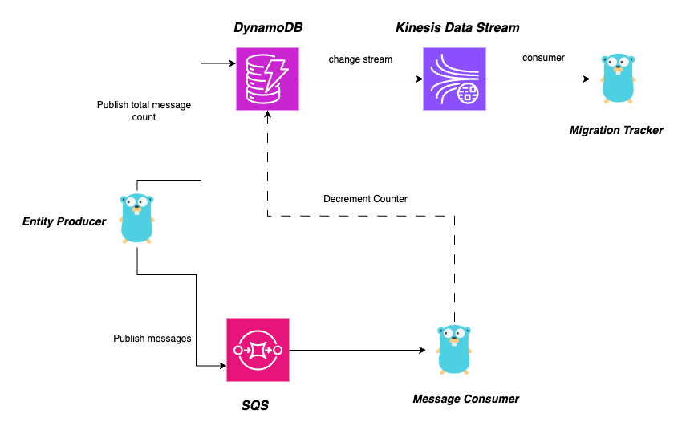
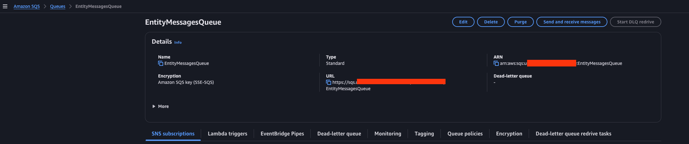
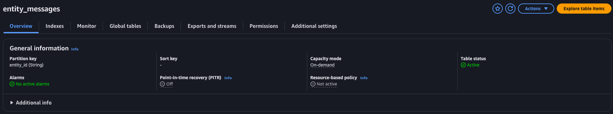
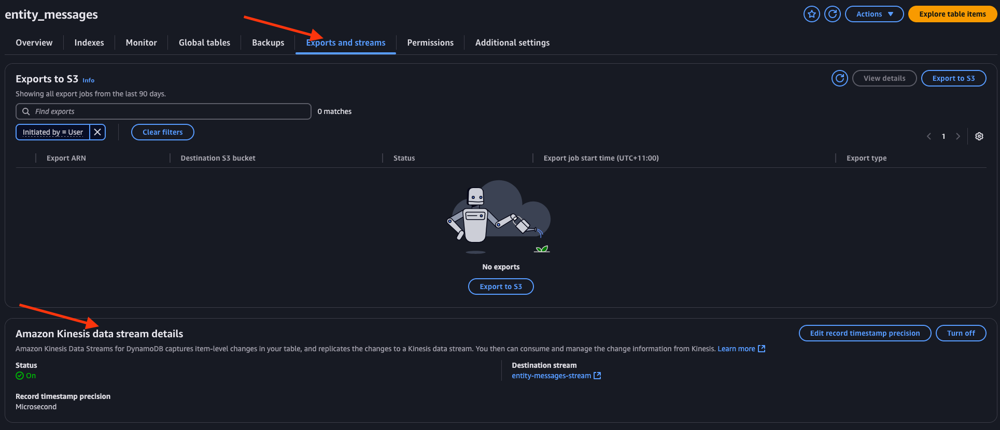
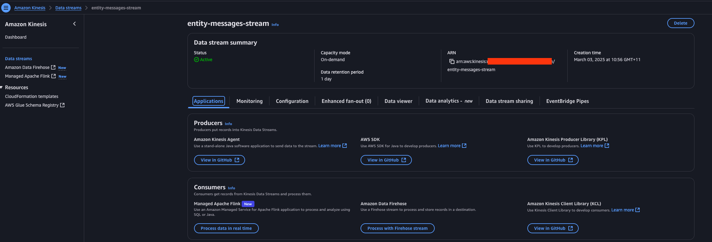
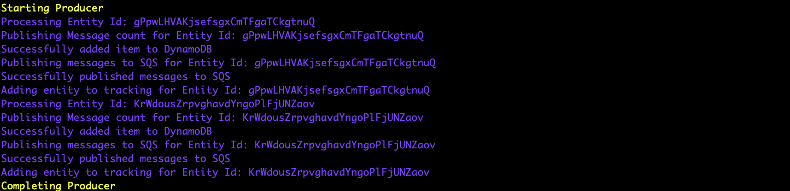
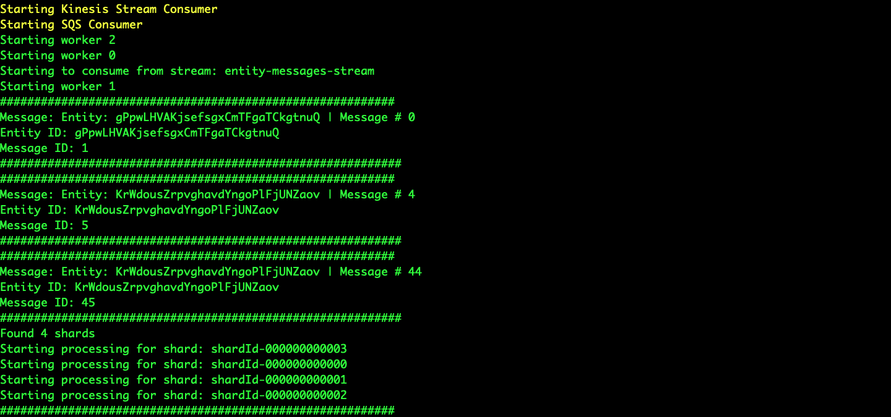
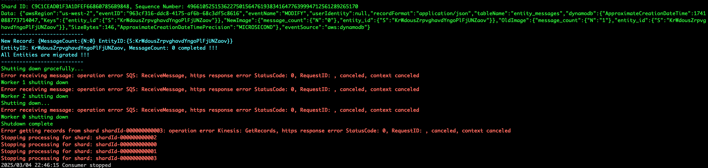

# AWS Queue Consume Tasks

Sample App to demonstrate distributed, event driven producer/consumer model using AWS Services

## Solution Logic

1. Read from command line
   1. Number of entities to generate
   2. Region
   3. SQS Url
   4. Dynamo table
   5. Kinesis for Dynamo Streams
2. Randomly generate Entity Ids
3. Randomly generate messages for each Entity
4. Enter the values in DynamoDB (entity_id + number of records)
5. Create Producer to publish the messages to SQS (one message for each row)
6. Create Consumer to consume messages from queue
   1. Print incoming message
   2. Decrement Atomic counter in DynamoDB
7. Publish results from DynamoDB to streams
   1. Subscribe to Stream
   2. Once value becomes zero, print message
   3. Once all combos are done, exit program

## Solution Design



## Running the Application

### AWS Setup

#### SQS Queue

Setup a SQS Queue to publish messages



#### DynamoDB Table

Create a DynamoDB Table with `entity_id` as the `Partition Key`



#### Enable Amazon Kinesis Data Streams for DynamoDB





### Running the App

#### Build

```shell
go build cmd/app/main.go
```

#### Run

```shell
./main -entity_count=<number_of_entity> -region=<aws_region> -ddb_table=<dynamo_table> -queue_url=<sqs_queue_url> -kinesis_stream_name=<kinesis_data_stream_name>
```






